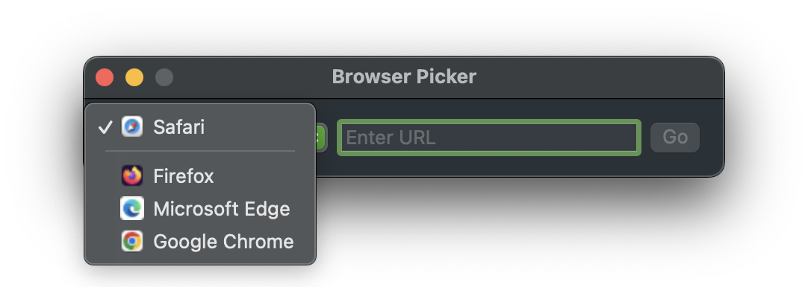

#  BrowserPicker

Sample application that lists available browser that is registered on the system. The browser picker mimicks the system default browser selector in the settings panel.
Select a browser and input a valid URL, and it will open it in the specified browser.

## Resources

[Custom AsyncImage View](https://bignerdranch.com/blog/asynchronously-load-images-with-customized-asyncimage-view-in-swiftui/)

How to customize AsyncImage with placeholder view.

[Official AsyncImage documentation](https://developer.apple.com/documentation/swiftui/asyncimage)

Apple's own documentation for AsyncImage.

[Article covering how to generate thumbnails](https://developer.apple.com/documentation/quicklookthumbnailing/creating-quick-look-thumbnails-to-preview-files-in-your-app)

Creating thumbnails the Apple way.

[How to use QLThumbnailGenerator](https://stackoverflow.com/questions/61829416/how-to-properly-return-an-image-from-qlthumbnailgenerator-swiftui)

Example of how to use QLThumbnailGenerator with SwiftUI.
